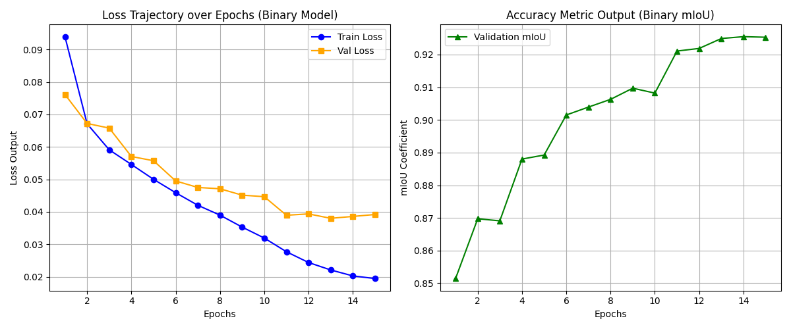

# 🚗 Real-Time Drivable Space Segmentation

## Problem Statement

The objective of this project is to build a mathematically rigorous and highly accurate (targeting `90% mIoU`) computer vision pipeline capable of detecting general drivable boundaries strictly within a **real-time execution window** (`77 FPS`) on local consumer hardware.

Real-world driving environments have enormous variance—ranging from completely unlined rural roads to brightly structured highways. To ensure the artificial network generalizes rather than memorizes, we actively compiled **NuScenes, and the India Driving Dataset (IDD)** into a massive, centralized `merged_road_dataset`.

To operate within our aggressive latency constraints while matching heavy parameter requirements, the network infrastructure utilizes a purely hand-engineered **EfficientNet-B2** scaling encoder paired forcefully with a **DeepLabV3+** Spatial Pyramid Pooling decoder algorithm to capture both microscopic edge boundaries and macroscopic structural context.

---

## Dataset & Training Strategy (Merged Road Context)

The compilation of the **Merged Road Dataset** relies heavily on aggressively isolating the data into strict Train, Validation, and unseen Test subsets purely to defeat data leakage. During the actual epoch loop (`train_effnet_merged.py`), the `MergedRoadDataset` torch loader intrinsically binds severe matrix augmentations (`torchvision.transforms.functional.affine`) across spatial planes to systematically stress the geometry learning cap.

The network optimization relies entirely on an isolated `MultiClassDiceFocalLoss` engine designed deliberately to mathematically crush precision failures on harsh categorical boundary imbalances.

### Network Progression Mapping

Below is the graph visualization mapping out the model's combinatorial loss trajectory and evaluation limits natively during the execution cycle:



---

## Final Mathematical Evaluation (Test Split)

The stabilized system weights (`drivable_model_effnet_merged.pth`) were extracted and benchmarked algorithmically strictly against `1,052` entirely unseen, un-augmented graphical frames living randomly in the isolated `test/` boundaries of the merged road hub.

| Physical Metric | Recorded Result | 
| :--- | :--- | :--- | :--- |
| **Hardware Used** | PyTorch CUDA Tensor Cores | 
| **Total Test Split Loss** | `0.0559` | 
| **Generalized mIoU** | **`90.17%`** | 
| **Execution Speeds** | **`~77.98 FPS`** | 

Visual artifact matrices and diagnostic dashcam streams for these 1,000+ unseen boundaries run by the AI brain were exclusively dumped into the native `/inference_effnet_test_results/` system directory.

---

## 🛠️ Installation & Community Usage

We have exposed our >60 FPS optimized architectural weights specifically for generalized community testing! 
You do **not** need the heavy `merged_road_dataset` to evaluate the structure.

### 1. Clone & Install Dependencies
First, clone the secure repository and install the tracked pip ecosystem:
```bash
git clone https://github.com/ShhlokRastogi/Real-Time-Drivable-Space-Segmentation.git
cd Real-Time-Drivable-Space-Segmentation
pip install -r requirements.txt
```

### 2. Plug-and-Play Inference
We have engineered two highly-parallel CPU/GPU fallback pipelines specifically designed to operate natively on your customized hardware inputs:

#### Option A: Real-Time Dashcam Video
Evaluates the core model dynamically across moving dashcam videos, directly dumping the visual 2D segmentation limits accurately onto a new MP4 geometry stream.
```bash
python inference_video.py --video "my_dashcam.mp4"
```

#### Option B: Image Sweeper Array
Recursively sweeps through entire raw folders capturing completely isolated photo grids and saving them dynamically back utilizing our best metrics bounds.
```bash
python inference_images.py --folder "./my_random_images"
```
